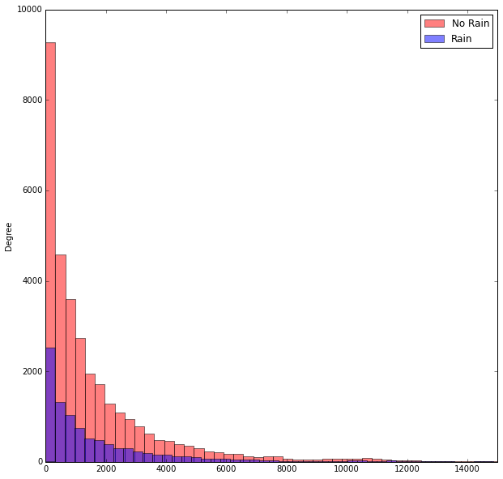

## P2: Analyzing Subway Data
### Student: Andy Miller
#### October 7th 2015


```python
# General Imports
import pandas as pd
import scipy.stats
import statsmodels.api as sm
import matplotlib.pyplot as plt
import numpy as np
from ggplot import *
%matplotlib inline

# Import the Data
ts = pd.read_csv('/Users/Miller/GitHub/GhNanoDegree/Projects/P2_Analyzing_Subway_Data/Dataset/turnstile_weather_v2.csv')

# Columns to Lowercase
ts.columns = [x.lower() for x in ts.columns]

# Review
ts.info()
ts.head()
```

    <class 'pandas.core.frame.DataFrame'>
    Int64Index: 42649 entries, 0 to 42648
    Data columns (total 27 columns):
    unit               42649 non-null object
    daten              42649 non-null object
    timen              42649 non-null object
    entriesn           42649 non-null int64
    exitsn             42649 non-null int64
    entriesn_hourly    42649 non-null float64
    exitsn_hourly      42649 non-null float64
    datetime           42649 non-null object
    hour               42649 non-null int64
    day_week           42649 non-null int64
    weekday            42649 non-null int64
    station            42649 non-null object
    latitude           42649 non-null float64
    longitude          42649 non-null float64
    conds              42649 non-null object
    fog                42649 non-null int64
    precipi            42649 non-null float64
    pressurei          42649 non-null float64
    rain               42649 non-null int64
    tempi              42649 non-null float64
    wspdi              42649 non-null float64
    meanprecipi        42649 non-null float64
    meanpressurei      42649 non-null float64
    meantempi          42649 non-null float64
    meanwspdi          42649 non-null float64
    weather_lat        42649 non-null float64
    weather_lon        42649 non-null float64
    dtypes: float64(14), int64(7), object(6)
    memory usage: 9.1+ MB


<div>
<table border="1" class="dataframe">
  <thead>
    <tr style="text-align: right;">
      <th></th>
      <th>unit</th>
      <th>daten</th>
      <th>timen</th>
      <th>entriesn</th>
      <th>exitsn</th>
      <th>entriesn_hourly</th>
      <th>exitsn_hourly</th>
      <th>datetime</th>
      <th>hour</th>
      <th>day_week</th>
      <th>...</th>
      <th>pressurei</th>
      <th>rain</th>
      <th>tempi</th>
      <th>wspdi</th>
      <th>meanprecipi</th>
      <th>meanpressurei</th>
      <th>meantempi</th>
      <th>meanwspdi</th>
      <th>weather_lat</th>
      <th>weather_lon</th>
    </tr>
  </thead>
  <tbody>
    <tr>
      <th>0</th>
      <td>R003</td>
      <td>05-01-11</td>
      <td>00:00:00</td>
      <td>4388333</td>
      <td>2911002</td>
      <td>0</td>
      <td>0</td>
      <td>2011-05-01 00:00:00</td>
      <td>0</td>
      <td>6</td>
      <td>...</td>
      <td>30.22</td>
      <td>0</td>
      <td>55.9</td>
      <td>3.5</td>
      <td>0</td>
      <td>30.258</td>
      <td>55.98</td>
      <td>7.86</td>
      <td>40.700348</td>
      <td>-73.887177</td>
    </tr>
    <tr>
      <th>1</th>
      <td>R003</td>
      <td>05-01-11</td>
      <td>04:00:00</td>
      <td>4388333</td>
      <td>2911002</td>
      <td>0</td>
      <td>0</td>
      <td>2011-05-01 04:00:00</td>
      <td>4</td>
      <td>6</td>
      <td>...</td>
      <td>30.25</td>
      <td>0</td>
      <td>52.0</td>
      <td>3.5</td>
      <td>0</td>
      <td>30.258</td>
      <td>55.98</td>
      <td>7.86</td>
      <td>40.700348</td>
      <td>-73.887177</td>
    </tr>
    <tr>
      <th>2</th>
      <td>R003</td>
      <td>05-01-11</td>
      <td>12:00:00</td>
      <td>4388333</td>
      <td>2911002</td>
      <td>0</td>
      <td>0</td>
      <td>2011-05-01 12:00:00</td>
      <td>12</td>
      <td>6</td>
      <td>...</td>
      <td>30.28</td>
      <td>0</td>
      <td>62.1</td>
      <td>6.9</td>
      <td>0</td>
      <td>30.258</td>
      <td>55.98</td>
      <td>7.86</td>
      <td>40.700348</td>
      <td>-73.887177</td>
    </tr>
    <tr>
      <th>3</th>
      <td>R003</td>
      <td>05-01-11</td>
      <td>16:00:00</td>
      <td>4388333</td>
      <td>2911002</td>
      <td>0</td>
      <td>0</td>
      <td>2011-05-01 16:00:00</td>
      <td>16</td>
      <td>6</td>
      <td>...</td>
      <td>30.26</td>
      <td>0</td>
      <td>57.9</td>
      <td>15.0</td>
      <td>0</td>
      <td>30.258</td>
      <td>55.98</td>
      <td>7.86</td>
      <td>40.700348</td>
      <td>-73.887177</td>
    </tr>
    <tr>
      <th>4</th>
      <td>R003</td>
      <td>05-01-11</td>
      <td>20:00:00</td>
      <td>4388333</td>
      <td>2911002</td>
      <td>0</td>
      <td>0</td>
      <td>2011-05-01 20:00:00</td>
      <td>20</td>
      <td>6</td>
      <td>...</td>
      <td>30.28</td>
      <td>0</td>
      <td>52.0</td>
      <td>10.4</td>
      <td>0</td>
      <td>30.258</td>
      <td>55.98</td>
      <td>7.86</td>
      <td>40.700348</td>
      <td>-73.887177</td>
    </tr>
  </tbody>
</table>
<p>5 rows × 27 columns</p>
</div>


```python
# Subset the data into rain / no-rain samples.
tsNoRain = ts['entriesn_hourly'][ts['rain'] == 0]
print 'No Rain Rows: ',len(tsNoRain)
tsRain = ts['entriesn_hourly'][ts['rain'] == 1]
print 'Rain Rows:     ',len(tsRain)
```

    No Rain Rows:  33064
    Rain Rows:      9585


## Section 0. References
Please include a list of references you have used for this project. Please be specific - for example, instead of including a general website such as stackoverflow.com, try to include a specific topic from Stackoverflow that you have found useful.
#### 1. Python for Data Analysis by Wes McKinney (Chapters 2/5/6/7/8 - No specific reference - just additional learning on the broad topics).
I took a break from the Udacity program to work through some of Wes McKinney's Pandas for Data Analysis book, as I felt that I did not have the skills to work with data in Python, and thought that overall, while I could work through this project, I would be much more efficient and skilled if I took a break to learn pandas better.

#### 2. http://blog.minitab.com/blog/adventures-in-statistics/regression-analysis-how-to-interpret-the-constant-y-intercept 
I took a look at this to understand in greater depth why the constant is added for linear regression.

#### 3. http://blog.minitab.com/blog/adventures-in-statistics/regression-analysis-how-do-i-interpret-r-squared-and-assess-the-goodness-of-fit
I took a look at this to understand R2 in greater depth, particularly understanding how to read R2 in reference to the "goodness-of-fit".

## Section 1. Statistical Test

#### 1.1 Which statistical test did you use to analyze the NYC subway data? Did you use a one-tail or a two-tail P value? What is the null hypothesis? What is your p-critical value?

Utilized the Mann-Whitney U Test with a two-tailed p-value, where the hypotheses are as follows:

H0: P(x > y) = 0.5 --- Both populations (rain and no-rain) being compared are identical or very close to one another.

H1: P(x > y) != 0.5 --- One population (rain and no-rain) tends to be greater than the other. 

I used a p-critical value of 0.05.

#### 1.2 Why is this statistical test applicable to the dataset? In particular, consider the assumptions that the test is making about the distribution of ridership in the two samples.
The statistical test is applicable to this dataset because of the non-parametric nature of the data (i.e., non-normal distribution of the data). __Below, please find my test of one of the samples of data (for no rain entries data).__   As you will find the sample data is not normal, therefore nixing the use of a t-test.  We must use a test that allows for non-parametric data (i.e., Mann-Whitney U Test) to compare the means.


```python
# Shapiro-Wilk Test - Test to determine likliehood that the sample is drawn from a normally distributed population.
print 'Perform Shapiro-Wilk Test to determine if its parametric:'
w, p = scipy.stats.shapiro(tsNoRain)
print 'Test Stat: ',w,'\n','p-Value: ',p
print 'The p-value suggests that there is a 0% likelihood that we would observe a Shapiro Test Statistic as extreme as that, therefore confirming the data is not drawn from a normally distributed population.  In conclusion, we cannot utilize a t-test for comparing the samples, and must use some non-parametric test.'

# Because the distribution of the turnstile data is non-normal (see below), we will not perform a t-test 
# (which can only be used on normally distributed data). 
print '\nHistogram of data (no rain subset):'
print tsNoRain.plot(kind='hist')
```

    Perform Shapiro-Wilk Test to determine if its parametric:
    Test Stat:  0.595618069172 
    p-Value:  0.0
    The p-value suggests that there is a 0% likelihood that we would observe a Shapiro Test Statistic as extreme as that, therefore confirming the data is not drawn from a normally distributed population.  In conclusion, we cannot utilize a t-test for comparing the samples, and must use some non-parametric test.
    
    Histogram of data (no rain subset):
    Axes(0.125,0.125;0.775x0.775)


#### 1.3 What results did you get from this statistical test? These should include the following numerical values: p-values, as well as the means for each of the two samples under test.
Below please find the code and results from the Mann-Whitney U Test, commentary provided where necessary.


```python
# Perform Statistical Test - Mann-Whitney U Test

# Perform the Mann-Whitney U Test
# Returns the one-sided p-value and U Statistic
(U,p) = scipy.stats.mannwhitneyu(tsNoRain,tsRain)
# Third - Calculate the means for each series
mean_noRain = tsNoRain.mean()
mean_Rain = tsRain.mean()

# Handle the Results from the Scipy test - Multiple by 2 for two-tailed test (scipy test returns one-tailed)
p_value = 2*p

print 'Mann-Whitney Test Results: '
print 'Test statistic: ',U,'\np-Value: ',p_value, '\nNo Rain - Mean Entries: ',mean_noRain,'\nRain - Mean Entries: ', mean_Rain
```

    Mann-Whitney Test Results: 
    Test statistic:  153635120.5 
    p-Value:  5.48213914249e-06 
    No Rain - Mean Entries:  1845.53943866 
    Rain - Mean Entries:  2028.19603547


#### Descriptive Statistics for the two samples: 


```python
print 'Rain: \n', tsRain.describe(), '\n'
print 'No Rain: \n', tsNoRain.describe()
```

    Rain: 
    count     9585.000000
    mean      2028.196035
    std       3189.433373
    min          0.000000
    25%        295.000000
    50%        939.000000
    75%       2424.000000
    max      32289.000000
    Name: entriesn_hourly, dtype: float64 
    
    No Rain: 
    count    33064.000000
    mean      1845.539439
    std       2878.770848
    min          0.000000
    25%        269.000000
    50%        893.000000
    75%       2197.000000
    max      32814.000000
    Name: entriesn_hourly, dtype: float64


#### 1.4 What is the significance and interpretation of these results?
Mann-Whitney U is significant if the p-value obtained is LESS THAN or equal to the p critical value.  In this case, the p-value, 0.00000548213, is much smaller than the critical value we chose, 0.05, and therefore we can reject the null hypothesis.  Therefore, one might conclude that the mean of the entries when raining, is indeed greater than the mean of entries when there is no rain.  Meaning that when it rains, turnstile entries tend to increase as people prefer the subway, rather than walking above ground (IN THE RAIN!).

## Section 2. Linear Regression


```python
# Linear Regression (In Notebook)
# Setup the data
features = ts[['meanprecipi','rain','hour','meanwspdi','meantempi','day_week']]
dummy_conds = pd.get_dummies(ts['conds'], prefix='cnd') # Split out the 'conds' conditions column.
dummy_conds_cols = dummy_conds.columns
##['cnd_Clear', 'cnd_Fog', 'cnd_Haze', 'cnd_Heavy Rain','cnd_Light Drizzle', 'cnd_Light Rain', 'cnd_Mist','cnd_Mostly Cloudy', 'cnd_Overcast', 'cnd_Partly Cloudy','cnd_Rain', 'cnd_Scattered Clouds']
dummy_conds = dummy_conds[['cnd_Mist','cnd_Mostly Cloudy', 'cnd_Overcast','cnd_Clear', 'cnd_Fog', 'cnd_Haze', 'cnd_Heavy Rain','cnd_Light Drizzle', 'cnd_Light Rain', 'cnd_Partly Cloudy','cnd_Rain', 'cnd_Scattered Clouds']]

dummy_units = pd.get_dummies(ts['unit'], prefix='unit') # Split out the 'units'.
features = features.join(dummy_conds) # Add in the dummy conditions field
features = features.join(dummy_units) # Add in the dummy units field
del features['unit_R181'] # Delete one of the columns to avoid summing to 1.
features = sm.add_constant(features) # Add a constant value
values = ts.entriesn_hourly # Create a series with the predictor values. 

model = sm.OLS(values, features)
results = model.fit()
res_summary = results.summary()
intercept = results.params[0]
params = results.params[1:]

print res_summary
#print res_summary,'\nIntercept: ',intercept,'\nParameters',params

```

                                OLS Regression Results                            
    ==============================================================================
    Dep. Variable:        entriesn_hourly   R-squared:                       0.478
    Model:                            OLS   Adj. R-squared:                  0.474
    Method:                 Least Squares   F-statistic:                     151.4
    Date:                Wed, 07 Oct 2015   Prob (F-statistic):               0.00
    Time:                        20:53:50   Log-Likelihood:            -3.8745e+05
    No. Observations:               42649   AIC:                         7.754e+05
    Df Residuals:                   42392   BIC:                         7.776e+05
    Df Model:                         256                                         
    Covariance Type:            nonrobust                                         
    ========================================================================================
                               coef    std err          t      P>|t|      [95.0% Conf. Int.]
    ----------------------------------------------------------------------------------------
    const                 2522.0463    194.529     12.965      0.000      2140.765  2903.327
    meanprecipi           7254.3861    936.775      7.744      0.000      5418.289  9090.484
    rain                   110.5460     35.047      3.154      0.002        41.853   179.239
    hour                   122.3845      1.513     80.879      0.000       119.419   125.350
    meanwspdi              -27.3712      5.195     -5.268      0.000       -37.554   -17.188
    meantempi              -26.2529      1.768    -14.846      0.000       -29.719   -22.787
    day_week              -155.6094      5.586    -27.856      0.000      -166.558  -144.660
    cnd_Mist               925.5020    406.927      2.274      0.023       127.917  1723.087
    cnd_Mostly Cloudy      115.8585     53.372      2.171      0.030        11.249   220.468
    cnd_Overcast            75.0663     50.036      1.500      0.134       -23.005   173.138
    cnd_Clear              488.8047     53.134      9.199      0.000       384.660   592.949
    cnd_Fog                575.0051    293.100      1.962      0.050         0.524  1149.487
    cnd_Haze               720.1707     75.319      9.562      0.000       572.543   867.798
    cnd_Heavy Rain        -587.2689    127.513     -4.606      0.000      -837.197  -337.341
    cnd_Light Drizzle     -476.0732    118.513     -4.017      0.000      -708.360  -243.786
    cnd_Light Rain         599.0467     69.188      8.658      0.000       463.437   734.657
    cnd_Partly Cloudy      331.7548     64.575      5.138      0.000       205.187   458.322
    cnd_Rain              -814.2556     88.474     -9.203      0.000      -987.667  -640.844
    cnd_Scattered Clouds   568.4353     59.200      9.602      0.000       452.402   684.469
    unit_R003            -1484.1874    231.418     -6.413      0.000     -1937.772 -1030.603
    unit_R004            -1136.1279    229.364     -4.953      0.000     -1585.686  -686.569
    unit_R005            -1123.7364    230.372     -4.878      0.000     -1575.269  -672.204
    unit_R006            -1006.9564    227.902     -4.418      0.000     -1453.649  -560.264
    unit_R007            -1292.9234    231.146     -5.594      0.000     -1745.974  -839.872
    unit_R008            -1297.3498    231.393     -5.607      0.000     -1750.884  -843.816
    unit_R009            -1338.3390    229.403     -5.834      0.000     -1787.973  -888.705
    unit_R011             5516.8963    224.705     24.552      0.000      5076.470  5957.323
    unit_R012             6856.5997    224.108     30.595      0.000      6417.343  7295.857
    unit_R013              755.0405    224.108      3.369      0.001       315.784  1194.298
    unit_R016            -1052.0462    224.705     -4.682      0.000     -1492.473  -611.620
    unit_R017             2370.0352    224.108     10.575      0.000      1930.778  2809.292
    unit_R018             6122.3831    225.911     27.101      0.000      5679.594  6565.172
    unit_R019             1612.6341    226.037      7.134      0.000      1169.598  2055.671
    unit_R020             4546.1319    224.108     20.285      0.000      4106.875  4985.389
    unit_R021             2867.6746    224.705     12.762      0.000      2427.248  3308.101
    unit_R022             7690.5244    224.108     34.316      0.000      7251.267  8129.781
    unit_R023             4325.7018    224.108     19.302      0.000      3886.445  4764.959
    unit_R024             1576.6169    226.326      6.966      0.000      1133.014  2020.220
    unit_R025             3709.5265    226.037     16.411      0.000      3266.490  4152.563
    unit_R027             1140.1373    224.108      5.087      0.000       700.880  1579.394
    unit_R029             5402.1104    224.108     24.105      0.000      4962.853  5841.367
    unit_R030             1272.3040    224.108      5.677      0.000       833.047  1711.561
    unit_R031             2524.0728    224.108     11.263      0.000      2084.816  2963.330
    unit_R032             2622.4118    224.405     11.686      0.000      2182.573  3062.251
    unit_R033             6407.0835    224.108     28.589      0.000      5967.827  6846.341
    unit_R034             -644.9801    229.225     -2.814      0.005     -1094.265  -195.695
    unit_R035              984.6546    224.705      4.382      0.000       544.228  1425.081
    unit_R036             -886.1474    228.422     -3.879      0.000     -1333.858  -438.436
    unit_R037             -811.4562    226.489     -3.583      0.000     -1255.378  -367.534
    unit_R038            -1436.2131    229.042     -6.271      0.000     -1885.140  -987.286
    unit_R039             -872.3925    232.035     -3.760      0.000     -1327.185  -417.600
    unit_R040             -403.6923    226.202     -1.785      0.074      -847.053    39.669
    unit_R041             1272.1158    224.108      5.676      0.000       832.859  1711.373
    unit_R042            -1213.3938    225.933     -5.371      0.000     -1656.226  -770.561
    unit_R043             1059.2502    224.108      4.727      0.000       619.993  1498.507
    unit_R044             2850.6588    224.108     12.720      0.000      2411.402  3289.916
    unit_R046             6517.1104    224.108     29.080      0.000      6077.853  6956.367
    unit_R049              944.9223    224.108      4.216      0.000       505.665  1384.179
    unit_R050             2197.0620    224.705      9.778      0.000      1756.636  2637.488
    unit_R051             3306.6642    224.108     14.755      0.000      2867.407  3745.921
    unit_R052             -390.4698    230.103     -1.697      0.090      -841.477    60.538
    unit_R053             1524.6996    226.219      6.740      0.000      1081.306  1968.093
    unit_R054             -358.7408    224.705     -1.596      0.110      -799.168    81.686
    unit_R055             6673.9410    225.615     29.581      0.000      6231.731  7116.151
    unit_R056             -370.0385    224.705     -1.647      0.100      -810.465    70.388
    unit_R057             3055.0513    224.108     13.632      0.000      2615.794  3494.308
    unit_R058            -1179.1617    224.406     -5.255      0.000     -1619.002  -739.322
    unit_R059             -616.4179    226.887     -2.717      0.007     -1061.121  -171.715
    unit_R060            -1003.3962    225.934     -4.441      0.000     -1446.231  -560.561
    unit_R061            -1169.8555    230.277     -5.080      0.000     -1621.203  -718.508
    unit_R062              908.9115    224.108      4.056      0.000       469.654  1348.169
    unit_R063             -612.3410    229.921     -2.663      0.008     -1062.991  -161.691
    unit_R064             -960.5528    227.210     -4.228      0.000     -1405.890  -515.216
    unit_R065             -939.6869    228.539     -4.112      0.000     -1387.628  -491.746
    unit_R066            -1511.0274    229.224     -6.592      0.000     -1960.312 -1061.743
    unit_R067             -734.6646    231.845     -3.169      0.002     -1189.085  -280.245
    unit_R068            -1141.5127    231.833     -4.924      0.000     -1595.911  -687.115
    unit_R069             -679.7334    229.722     -2.959      0.003     -1129.992  -229.475
    unit_R070              -40.1100    224.108     -0.179      0.858      -479.367   399.147
    unit_R080             1784.2179    224.108      7.961      0.000      1344.961  2223.475
    unit_R081             1733.6235    224.705      7.715      0.000      1293.197  2174.050
    unit_R082             -314.8192    224.705     -1.401      0.161      -755.245   125.607
    unit_R083             1298.6266    224.108      5.795      0.000       859.370  1737.884
    unit_R084             8202.9007    224.108     36.602      0.000      7763.644  8642.158
    unit_R085              786.9185    224.705      3.502      0.000       346.492  1227.345
    unit_R086              772.2179    224.108      3.446      0.001       332.961  1211.475
    unit_R087             -576.6618    225.313     -2.559      0.010     -1018.280  -135.044
    unit_R089            -1298.2581    224.705     -5.778      0.000     -1738.685  -857.832
    unit_R090            -1183.6208    231.842     -5.105      0.000     -1638.036  -729.206
    unit_R091             -491.7423    230.783     -2.131      0.033      -944.083   -39.402
    unit_R092              362.8191    228.744      1.586      0.113       -85.524   811.162
    unit_R093              408.3031    229.335      1.780      0.075       -41.199   857.805
    unit_R094              118.9356    226.202      0.526      0.599      -324.424   562.296
    unit_R095              542.3298    227.134      2.388      0.017        97.143   987.517
    unit_R096              704.3179    225.893      3.118      0.002       261.562  1147.073
    unit_R097             1331.4210    225.911      5.894      0.000       888.632  1774.210
    unit_R098                6.7771    224.108      0.030      0.976      -432.480   446.034
    unit_R099              563.8040    224.108      2.516      0.012       124.547  1003.061
    unit_R100            -1084.3985    226.861     -4.780      0.000     -1529.051  -639.746
    unit_R101              998.1964    224.108      4.454      0.000       558.939  1437.453
    unit_R102             1887.0352    224.108      8.420      0.000      1447.778  2326.292
    unit_R103             -221.2954    230.032     -0.962      0.336      -672.162   229.571
    unit_R104             -293.2674    226.189     -1.297      0.195      -736.602   150.067
    unit_R105             1536.7341    224.108      6.857      0.000      1097.477  1975.991
    unit_R106             -476.7893    231.777     -2.057      0.040      -931.077   -22.501
    unit_R107            -1070.3021    232.218     -4.609      0.000     -1525.454  -615.150
    unit_R108             3425.9007    224.108     15.287      0.000      2986.644  3865.158
    unit_R111             1423.0244    224.108      6.350      0.000       983.767  1862.281
    unit_R112               46.0044    225.893      0.204      0.839      -396.751   488.760
    unit_R114             -717.8253    226.335     -3.172      0.002     -1161.447  -274.204
    unit_R115             -339.8767    226.037     -1.504      0.133      -782.913   103.160
    unit_R116             1402.1696    224.108      6.257      0.000       962.913  1841.427
    unit_R117             -685.5413    231.405     -2.963      0.003     -1139.100  -231.983
    unit_R119              253.3295    227.717      1.112      0.266      -193.000   699.659
    unit_R120              -97.1794    229.356     -0.424      0.672      -546.721   352.362
    unit_R121             -294.1146    227.211     -1.294      0.196      -739.452   151.223
    unit_R122              952.2552    227.154      4.192      0.000       507.028  1397.482
    unit_R123             -143.2658    225.933     -0.634      0.526      -586.100   299.568
    unit_R124            -1085.2599    228.879     -4.742      0.000     -1533.868  -636.652
    unit_R126               64.0782    224.108      0.286      0.775      -375.179   503.335
    unit_R127             3004.7878    224.108     13.408      0.000      2565.531  3444.045
    unit_R137              819.8496    225.615      3.634      0.000       377.640  1262.060
    unit_R139              746.6976    224.405      3.327      0.001       306.859  1186.537
    unit_R163             1540.5244    224.108      6.874      0.000      1101.267  1979.781
    unit_R172              106.5620    224.108      0.475      0.634      -332.695   545.819
    unit_R179             4987.3362    224.108     22.254      0.000      4548.079  5426.593
    unit_R183             -775.1057    232.150     -3.339      0.001     -1230.124  -320.087
    unit_R184             -719.4489    229.224     -3.139      0.002     -1168.733  -270.165
    unit_R186             -692.6791    225.622     -3.070      0.002     -1134.902  -250.456
    unit_R188              544.1145    224.405      2.425      0.015       104.276   983.953
    unit_R189             -353.4160    226.886     -1.558      0.119      -798.118    91.286
    unit_R194              231.8109    226.248      1.025      0.306      -211.639   675.261
    unit_R196             -446.5122    225.008     -1.984      0.047      -887.532    -5.493
    unit_R198              333.7936    224.705      1.485      0.137      -106.633   774.220
    unit_R199            -1042.8520    226.249     -4.609      0.000     -1486.304  -599.400
    unit_R200             -520.0509    227.195     -2.289      0.022      -965.358   -74.743
    unit_R202              605.2395    226.188      2.676      0.007       161.906  1048.573
    unit_R203               10.9777    227.537      0.048      0.962      -435.000   456.956
    unit_R204             -331.9380    224.108     -1.481      0.139      -771.195   107.319
    unit_R205             -103.1419    226.822     -0.455      0.649      -547.717   341.434
    unit_R207              220.0735    224.405      0.981      0.327      -219.766   659.913
    unit_R208              908.6348    226.802      4.006      0.000       464.099  1353.171
    unit_R209             -923.3625    229.922     -4.016      0.000     -1374.015  -472.710
    unit_R210            -1210.1793    226.887     -5.334      0.000     -1654.882  -765.476
    unit_R211              625.4921    224.108      2.791      0.005       186.235  1064.749
    unit_R212              -85.9839    224.405     -0.383      0.702      -525.823   353.855
    unit_R213             -596.8233    226.565     -2.634      0.008     -1040.895  -152.751
    unit_R214            -1039.8926    230.276     -4.516      0.000     -1491.239  -588.547
    unit_R215             -178.5248    224.705     -0.794      0.427      -618.951   261.902
    unit_R216            -1007.7593    224.705     -4.485      0.000     -1448.186  -567.333
    unit_R217             -724.9908    229.923     -3.153      0.002     -1175.644  -274.337
    unit_R218              368.7514    225.917      1.632      0.103       -74.050   811.553
    unit_R219             -343.0645    226.208     -1.517      0.129      -786.436   100.307
    unit_R220             -299.7821    224.108     -1.338      0.181      -739.039   139.475
    unit_R221             -299.4245    230.277     -1.300      0.194      -750.773   151.924
    unit_R223              508.2638    225.893      2.250      0.024        65.508   951.019
    unit_R224            -1004.1637    227.211     -4.420      0.000     -1449.501  -558.826
    unit_R225            -1193.8921    225.622     -5.292      0.000     -1636.116  -751.668
    unit_R226             -819.5949    230.766     -3.552      0.000     -1271.901  -367.289
    unit_R227             -680.5186    224.108     -3.037      0.002     -1119.776  -241.262
    unit_R228             -635.0057    229.573     -2.766      0.006     -1084.974  -185.037
    unit_R229            -1159.6733    228.879     -5.067      0.000     -1608.282  -711.065
    unit_R230            -1214.9638    227.536     -5.340      0.000     -1660.939  -768.988
    unit_R231             -792.9017    225.622     -3.514      0.000     -1235.125  -350.679
    unit_R232             -697.0098    228.539     -3.050      0.002     -1144.952  -249.068
    unit_R233             -611.1688    230.997     -2.646      0.008     -1063.928  -158.410
    unit_R234            -1397.4230    229.923     -6.078      0.000     -1848.077  -946.769
    unit_R235              798.9410    224.406      3.560      0.000       359.101  1238.781
    unit_R236              -70.1702    226.799     -0.309      0.757      -514.701   374.361
    unit_R237             -906.3127    231.033     -3.923      0.000     -1359.142  -453.483
    unit_R238              492.0294    225.911      2.178      0.029        49.240   934.819
    unit_R239             -883.3573    224.108     -3.942      0.000     -1322.614  -444.100
    unit_R240              891.4668    225.007      3.962      0.000       450.448  1332.486
    unit_R242            -1190.1558    226.566     -5.253      0.000     -1634.231  -746.081
    unit_R243             -210.5737    229.712     -0.917      0.359      -660.813   239.666
    unit_R244               -2.6624    229.635     -0.012      0.991      -452.752   447.427
    unit_R246            -1054.7019    229.572     -4.594      0.000     -1504.668  -604.736
    unit_R247            -1553.6521    231.736     -6.704      0.000     -2007.859 -1099.446
    unit_R248             1329.0273    224.405      5.922      0.000       889.188  1768.866
    unit_R249             -392.4193    225.933     -1.737      0.082      -835.252    50.414
    unit_R250             -777.8877    226.566     -3.433      0.001     -1221.962  -333.814
    unit_R251             -486.7460    225.009     -2.163      0.031      -927.768   -45.724
    unit_R252             -813.9243    224.705     -3.622      0.000     -1254.350  -373.498
    unit_R253             -910.6727    230.125     -3.957      0.000     -1361.723  -459.623
    unit_R254              968.4899    225.913      4.287      0.000       525.697  1411.283
    unit_R255             -809.1414    227.198     -3.561      0.000     -1254.453  -363.829
    unit_R256             -722.4701    224.705     -3.215      0.001     -1162.897  -282.044
    unit_R257              103.8147    224.108      0.463      0.643      -335.442   543.072
    unit_R258             -250.0199    225.008     -1.111      0.267      -691.039   190.999
    unit_R259             -833.0472    225.934     -3.687      0.000     -1275.882  -390.212
    unit_R260             -693.3715    234.449     -2.957      0.003     -1152.897  -233.846
    unit_R261              -13.1721    228.388     -0.058      0.954      -460.817   434.473
    unit_R262            -1240.4015    231.735     -5.353      0.000     -1694.607  -786.196
    unit_R263            -1637.2853    226.566     -7.227      0.000     -2081.359 -1193.212
    unit_R264            -1313.0508    224.405     -5.851      0.000     -1752.890  -873.212
    unit_R265             -840.0588    228.880     -3.670      0.000     -1288.668  -391.449
    unit_R266             -708.5186    225.899     -3.136      0.002     -1151.286  -265.752
    unit_R269             -889.6604    224.705     -3.959      0.000     -1330.087  -449.234
    unit_R270            -1248.5084    229.575     -5.438      0.000     -1698.480  -798.537
    unit_R271            -1369.5346    229.224     -5.975      0.000     -1818.819  -920.250
    unit_R273             -430.4858    229.928     -1.872      0.061      -881.150    20.178
    unit_R274             -809.5944    228.540     -3.542      0.000     -1257.538  -361.651
    unit_R275             -695.4239    228.478     -3.044      0.002     -1143.246  -247.602
    unit_R276             -373.6476    224.108     -1.667      0.095      -812.905    65.609
    unit_R277            -1246.8462    232.872     -5.354      0.000     -1703.280  -790.412
    unit_R278            -1378.0805    228.879     -6.021      0.000     -1826.689  -929.472
    unit_R279             -826.8463    227.777     -3.630      0.000     -1273.293  -380.399
    unit_R280            -1086.7084    232.117     -4.682      0.000     -1541.662  -631.755
    unit_R281             -484.9845    225.933     -2.147      0.032      -927.818   -42.151
    unit_R282             -193.8102    224.705     -0.863      0.388      -634.237   246.616
    unit_R284            -1005.5276    224.705     -4.475      0.000     -1445.954  -565.102
    unit_R285             -959.2589    232.188     -4.131      0.000     -1414.351  -504.167
    unit_R287            -1150.5345    230.638     -4.988      0.000     -1602.590  -698.479
    unit_R291               19.5835    224.108      0.087      0.930      -419.673   458.841
    unit_R294             -821.7951    226.887     -3.622      0.000     -1266.497  -377.093
    unit_R295            -1018.5625    243.927     -4.176      0.000     -1496.665  -540.460
    unit_R300              428.6481    224.108      1.913      0.056       -10.609   867.905
    unit_R303             -538.9208    225.933     -2.385      0.017      -981.754   -96.088
    unit_R304             -707.5248    224.705     -3.149      0.002     -1147.951  -267.099
    unit_R307            -1221.0680    232.194     -5.259      0.000     -1676.172  -765.964
    unit_R308             -799.3507    229.751     -3.479      0.001     -1249.668  -349.034
    unit_R309             -801.7101    229.398     -3.495      0.000     -1251.334  -352.086
    unit_R310             -280.4458    230.710     -1.216      0.224      -732.643   171.751
    unit_R311            -1364.2247    227.537     -5.996      0.000     -1810.202  -918.247
    unit_R312            -1446.8746    225.007     -6.430      0.000     -1887.894 -1005.856
    unit_R313            -1511.1947    232.523     -6.499      0.000     -1966.945 -1055.445
    unit_R318            -1236.6282    225.313     -5.489      0.000     -1678.245  -795.011
    unit_R319             -423.4550    226.247     -1.872      0.061      -866.904    19.994
    unit_R321             -708.7552    224.108     -3.163      0.002     -1148.012  -269.498
    unit_R322               -8.0945    226.247     -0.036      0.971      -451.544   435.355
    unit_R323             -472.3767    228.540     -2.067      0.039      -920.320   -24.434
    unit_R325            -1262.5129    229.157     -5.509      0.000     -1711.665  -813.361
    unit_R330             -787.2759    226.886     -3.470      0.001     -1231.977  -342.574
    unit_R335            -1172.1953    233.215     -5.026      0.000     -1629.301  -715.089
    unit_R336            -1555.9899    233.259     -6.671      0.000     -2013.182 -1098.798
    unit_R337            -1507.5320    231.845     -6.502      0.000     -1961.952 -1053.112
    unit_R338            -1649.7200    229.793     -7.179      0.000     -2100.119 -1199.321
    unit_R341            -1093.9298    226.893     -4.821      0.000     -1538.645  -649.215
    unit_R344            -1307.5495    231.367     -5.651      0.000     -1761.033  -854.066
    unit_R345            -1306.9934    227.537     -5.744      0.000     -1752.970  -861.017
    unit_R346             -527.5868    227.869     -2.315      0.021      -974.215   -80.958
    unit_R348            -1468.6942    229.361     -6.403      0.000     -1918.247 -1019.142
    unit_R354            -1380.9956    232.131     -5.949      0.000     -1835.976  -926.015
    unit_R356             -515.0895    229.189     -2.247      0.025      -964.304   -65.875
    unit_R358            -1355.3248    232.098     -5.839      0.000     -1810.242  -900.407
    unit_R370            -1294.6219    227.210     -5.698      0.000     -1739.959  -849.285
    unit_R371            -1073.3262    228.539     -4.696      0.000     -1521.268  -625.384
    unit_R372            -1048.5115    229.572     -4.567      0.000     -1498.477  -598.546
    unit_R373            -1152.4755    229.924     -5.012      0.000     -1603.132  -701.819
    unit_R382             -688.3934    228.739     -3.010      0.003     -1136.726  -240.061
    unit_R424            -1401.8465    230.998     -6.069      0.000     -1854.607  -949.086
    unit_R429             -632.6278    226.505     -2.793      0.005     -1076.582  -188.674
    unit_R453              -10.2792    232.125     -0.044      0.965      -465.250   444.691
    unit_R454            -1662.8454    230.278     -7.221      0.000     -2114.195 -1211.495
    unit_R455            -1716.3350    229.927     -7.465      0.000     -2166.996 -1265.674
    unit_R456            -1565.7113    226.889     -6.901      0.000     -2010.419 -1121.004
    unit_R459            -1528.4797    280.407     -5.451      0.000     -2078.082  -978.877
    unit_R464            -1712.8950    231.352     -7.404      0.000     -2166.349 -1259.441
    ==============================================================================
    Omnibus:                    27527.945   Durbin-Watson:                   1.589
    Prob(Omnibus):                  0.000   Jarque-Bera (JB):           807267.621
    Skew:                           2.655   Prob(JB):                         0.00
    Kurtosis:                      23.642   Cond. No.                     7.94e+15
    ==============================================================================
    
    Warnings:
    [1] Standard Errors assume that the covariance matrix of the errors is correctly specified.
    [2] The smallest eigenvalue is 2.83e-24. This might indicate that there are
    strong multicollinearity problems or that the design matrix is singular.


#### 2.1 What approach did you use to compute the coefficients theta and produce prediction for ENTRIESn_hourly in your regression model:
Utilized OLS using Statsmodels.

#### 2.2 What features (input variables) did you use in your model? Did you use any dummy variables as part of your features?
I experimented quite a bit and settled on doing the following: 
- Dummy'ing the 'unit' variable (and excluding 1 item)
- Dummy'ing the 'conds' variable 
- Including the following variables: 'meanprecipi','rain','hour','meanwspdi','meantempi','precipi','day_week'

#### 2.3 Why did you select these features in your model? We are looking for specific reasons that lead you to believe that the selected features will contribute to the predictive power of your model. Your reasons might be based on intuition. For example, response for fog might be: “I decided to use fog because I thought that when it is very foggy outside people might decide to use the subway more often.” Your reasons might also be based on data exploration and experimentation, for example: “I used feature X because as soon as I included it in my model, it drastically improved my R2 value.”  
Most of my features selection are based upon two things: 1) Intuition, and 2) Trial-and-Error through review of the R2 value.  Here is a breakdown:
- meanprecipi / rain / meanwspdi: all of these are items that I firmly believed would have some legitimate impact on someone's choice to utilize the subway.  That is, the more wind / rain, the more likely a person may be to dive down into a subway station for transport. 'precipi' not included because it did not increase my R2, despite my intuition that precipitation is one of the basics to why persons would choose subway or not (i.e., walking)). However, upon further investigation, I believe that my other feature, 'meanprecipi' is sufficient AND a more ideal feature (this was tested exclusively and the 'meanprecipi' prevailed in R2 augmentation). 
- hour / day_week / unit: Included as these have a signficant conditional impact to the number of entries, regardless of the conditions.  For example, the hour of the day varies widely between 3am (early morning) and 8am (commute), and entries are, of course, more significant at peak hours.  I reviewed the results without the 'hour' variable and there is a STEEP decrease in R2 (roughly .1).
- 'cond_xxxx' features: These varibles were dummied and added as features, as I experimented with the impact on the R2.  Of particular note was that removal of cond_fog and cond-haze each decreased R2 (whereas I was surprised considering the lack of connection to taking the subway, in my opinion).  The other thing that should be noted is the lack of significance (p-value) for: 'cnd_Mist','cnd_Mostly Cloudy', 'cnd_Overcast'.  However removal did not improve R2.

#### 2.4 What are the parameters (also known as "coefficients" or "weights") of the non-dummy features in your linear regression model?
Refer to the above answer for greater detail on the following: 
meanprecipi
rain
hour
day_week
meanwspdi
meantempi

#### 2.5 What is your model’s R2 (coefficients of determination) value?
0.478

#### 2.6 What does this R2 value mean for the goodness of fit for your regression model? 
The R2 value is a measure of how close the data are to the fitted regression line (i.e., Residual = Observed Value - Fitted Value), therefore the closer the fit, the better the R2. Overall, roughly 50% of the variability of the response data around its mean is explained by the model.  

#### Do you think this linear model to predict ridership is appropriate for this dataset, given this R2  value?
While the R2 is not necessarily very high, this does not mean that the linear model is inadequate.  In this case, I believe there are many variables that may impact a the number of hourly entries, and further analysis (i.e., longer time period) might be necessary to draw conclusions.  There seem to be a limited number of additional variables (features) that can influence the dependent variable (entries).  Overall, I do believe that this linear model is sufficient for this dataset.  

### Section 3. Visualization

### Please include two visualizations that show the relationships between two or more variables in the NYC subway data.
#### Remember to add appropriate titles and axes labels to your plots. Also, please add a short description below each figure commenting on the key insights depicted in the figure.

#### 3.1 One visualization should contain two histograms: one of  ENTRIESn_hourly for rainy days and one of ENTRIESn_hourly for non-rainy days.
##### -You can combine the two histograms in a single plot or you can use two separate plots.
##### -If you decide to use to two separate plots for the two histograms, please ensure that the x-axis limits for both of the plots are identical. It is much easier to compare the two in that case.
##### -For the histograms, you should have intervals representing the volume of ridership (value of ENTRIESn_hourly) on the x-axis and the frequency of occurrence on the y-axis. For example, each interval (along the x-axis), the height of the bar for this interval will represent the number of records (rows in our data) that have ENTRIESn_hourly that falls in this interval.
##### -Remember to increase the number of bins in the histogram (by having larger number of bars). The default bin width is not sufficient to capture the variability in the two samples.


```python
print 'Plot #1 - Histogram of Entries (Rain and Non-Rain Days)'
rain = ts[ts['rain']==1]['entriesn_hourly']
no_rain = ts[ts['rain']==0]['entriesn_hourly']
ax = no_rain.plot(kind='hist', bins = 100, alpha = .5, color = 'red',label = 'No Rain',xlim = (0,15000),figsize = (10,10))
ax = rain.plot(kind='hist', bins = 100, alpha = .5, color = 'blue',label = 'Rain',xlim = (0,15000),figsize = (10,10))
#ax.set_xlabel('Histogram of Entries Values ')
ax.legend()
```

    Plot #1 - Histogram of Entries (Rain and Non-Rain Days)


    <matplotlib.legend.Legend at 0x115da2ed0>





#### 3.2 One visualization can be more freeform. You should feel free to implement something that we discussed in class (e.g., scatter plots, line plots) or attempt to implement something more advanced if you'd like. Some suggestions are: 
Ridership by time-of-day
Ridership by day-of-week


```python
print 'Ridership by time-of-day:'
df1 = ts[['entriesn_hourly','hour','rain']]
df2 = df1.groupby(['hour','rain']).sum().reset_index()
df_totals = df2.groupby('hour').sum().reset_index()

print 'Caption: As you can see, the subway is very active from 8am to 12, the morning commute, when it dips slightly after lunch, before taking off again for the evening commute.'

ggplot(df_totals,aes('hour','entriesn_hourly')) + geom_line(size = 6) + ggtitle('Entries by Hour')

# Others that didn't make much sense.
#ggplot(df2,aes('hour','entriesn_hourly',color = 'rain')) + geom_line(size = 6) + ggtitle('Entries by Hour')
#plot = ggplot(df2,aes('hour','entriesn_hourly')) + geom_line(size = 6) + stat_smooth
#plot = ggplot() + geom_line(df2,aes('hour','entriesn_hourly',color='rain')) #+ geom_line(df_totals,aes('hour','entriesn_hourly'))
```

    Ridership by time-of-day:
    Caption: As you can see, the subway is very active from 8am to 12, the morning commute, when it dips slightly after lunch, before taking off again for the evening commute.


    <ggplot: (291367041)>


```python
print 'Ridership by day-of-week (Mon-Sun):'
df1 = ts[['entriesn_hourly','day_week','rain']]
df2 = df1.groupby(['day_week','rain']).sum().reset_index()
df_totals = df2.groupby('day_week').sum().reset_index()

print 'Caption: As you can see, the subway is very active from Monday thorugh Friday, with Tuesday being the most active day of the week, before dipping significantly on the weekend.'

ggplot(df_totals,aes('day_week','entriesn_hourly')) + geom_line(size = 6) + ggtitle('Entries by Day of Week')
```

    Ridership by day-of-week (Mon-Sun):
    Caption: As you can see, the subway is very active from Monday thorugh Friday, with Tuesday being the most active day of the week, before dipping significantly on the weekend.


    <ggplot: (293580369)>


### Section 4. Conclusion

#### Please address the following questions in detail. Your answers should be 1-2 paragraphs long.
#### 4.1 From your analysis and interpretation of the data, do more people ride the NYC subway when it is raining or when it is not raining?
When it is raining.  Please review 4.2 (addressed and explained in-depth).
#### 4.2 What analyses lead you to this conclusion? You should use results from both your statistical tests and your linear regression to support your analysis.
Its clear that there is more ridership when its raining or the conditions outside are poor.  The way I support this conclusion is : 
* Mann-Whitney U Test - As shown above, the results of the test on two subsets of data (raining vs. not-raining) led us to reject the null hypothesis, which was that both samples essentially come from the same population.  The alternative, that one population tends to be greater, is accepted (as the p-value is less than our set significance level).  When reviewing the descriptive statistics (produced by the describe() function) we can clearly come to some conclusions: 
 * First, there are far fewer records for the "Rain" subset, which makes sense, even though its May in NYC (spring).  Obviously there are more times where its not raining than raining (in the 4 hour increments).
 * The mean entries is greater for "Rain" subset (2028 vs. 1845), suggesting that entries increase when its raining.  
 * The median entries is greater for "Rain" subset (939 vs. 893), which essentially confirms what the mean told us (but with better control in case there was a significant outlier in one of the subsets).
* Linear Regression - Using linear regression was a valuable way to understand the variables that contribute to the increase or decrease of entries.  Upon review of the "OLS Regression Results" (model achieved an R-Squared of 0.478) we better understand what affects entries.  Here are some key points: 
 * The "meanprecipi" variable has an affect on entries - though not as much as it appears.  The coefficient is 7254, referencing a whole 1 inch of rain (which is alot of rain in any four hour period).  Regardless, the more precipition, the more people prefer to ride the subway (as opposed to walking).
 * The "Rain" variable coefficient value is 110 - meaning that when this binary variable is increased from 0 to 1, the entries increase by 110, supporting the case that rain causes more people to seek subway transportation. 
 * The variables created from the conditions field are interesting.  First, "cnd_Heavy Rain", "cnd_Rain" and "cnd_Light Drizzle" is modeled such that if there is rain / drizzle - there is a decrease in ridership.  Isn't that weird?  Well, I believe it might be due to people not riding or walking if the conditions are such (possibly waiting it out and contributing their entry in a later period, where the conditions may have turned to mostly cloudy / etc.).  However, I am generally confounded because "cnd_Light Rain", which is presumably the difference between Rain and Light Drizzle, doesn't conform in the same way, in that the ridership increases.   
* Visualization - Visualization helps us analyze the trend in a way that the brain can generally make more sense of.  The dual histogram showing the frequencies of the values is interesting but doesn't support my conclusion, which I believe is solely due to the disparity in record counts - because there are so many more periods for non-rain than there is for rain.  The other visualizations helped me better understand the data (by day / by hour), irrespective of rain consideration.

Overall, I will confidently conclude that ridership increases in rain (or poor conditions for that matter).

### Section 5. Reflection

#### Please address the following questions in detail. Your answers should be 1-2 paragraphs long.
#### 5.1 Please discuss potential shortcomings of the methods of your analysis, including: Dataset, Analysis, such as the linear regression model or statistical test.
#### 5.1 Please discuss potential shortcomings of the methods of your analysis, including: Dataset, Analysis, such as the linear regression model or statistical test.

There are certainly shortcomings with many of the methods used - which is the reason why it is important to perform varying forms of analysis (such as statistical analysis and regression).  I will address the items most important / noticable to me below:
* Dataset 
 * The data is in transactional form at a 4 hour increment level.  This is good AND bad.  While we prefer to have aggregated data for simplicity and ease of handling, this clouds (no PUN intended) the accuracy of our analysis, as 4 hours is a significant period of time to group together especially with weather (e.g., its raining from 8am to 9am, but sunny from 9am to noon).  More detailed information would be preferred (maybe at the 30-min to 1-hr increment).
 * The "rain" variable is ambiguous, in that its a binary variable for if rain occurred during the DAY for that location.  This is not a very good indicator when we are looking at the data in 4 hour increments (i.e., it would be better if the indicator referred to that 4-hour period).  
* Analysis
 * Our analysis does not consider extraneous factors (various events, etc. that have impacted the flow of movement). For example, what if Madison Square Garden was very active during the month due to the Knicks and Rangers being in playoff contention during the period.  There might be more traffic by subway into the city no matter the condition.  If looking at this data in more depth, we might consider trying to eliminate any periods that might be affected by events. 
 * The linear regression model did not achieve a high R2 value.  This  does not necessarily mean the model is inadequate, but it does cast some doubt on the contributions of the independent variables within the model.
 
#### 5.2 (Optional) Do you have any other insight about the dataset that you would like to share with us?

Honestly, I am not one to leave an optional question blank, but I was very thorough above.  
